# Bài 1
## Chạy bằng curl

## List rỗng
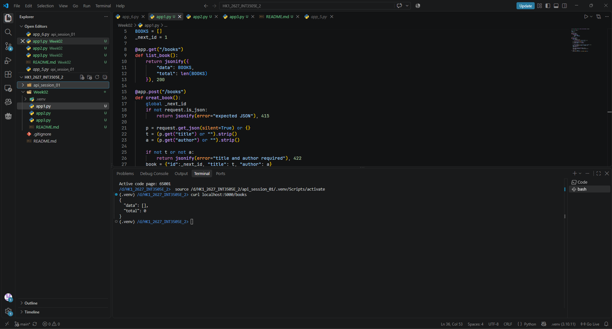

## Tạo cuốn
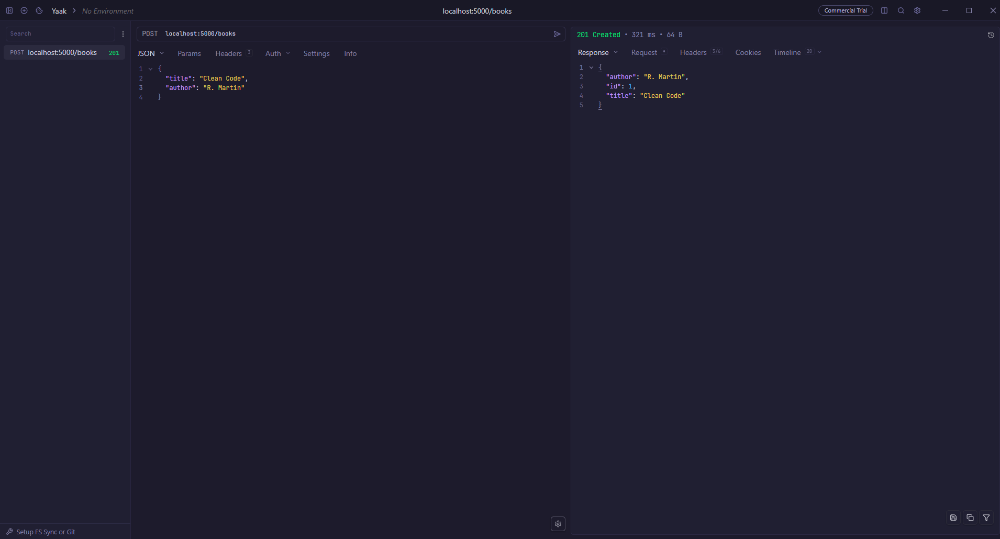

## Các status code mong đợi
#### POST OK 201:
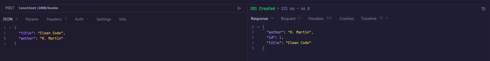

#### POST thiếu field 422:
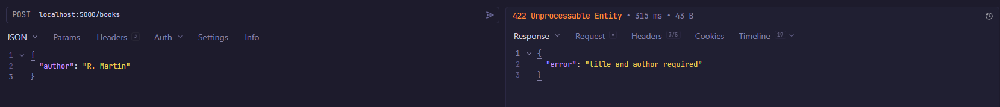

#### POST sai JSON 400 
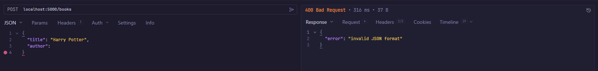
Để có đoạn này, phải thêm code:

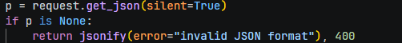

#### POST thiếu Content-Type 415
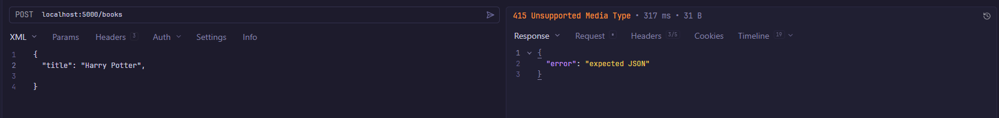

---

# Bài 2
## PATCH - Đổi 1 field
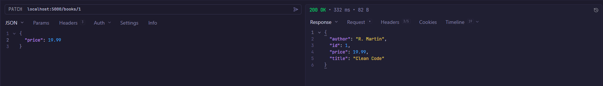

## PUT - Thay thế
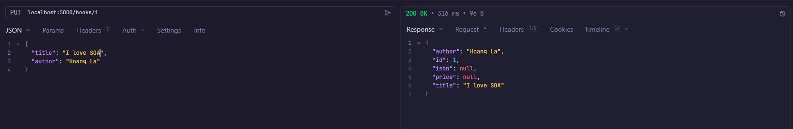

## DELETE - trả 204
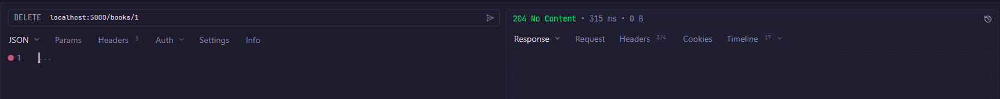

---

# Bài 3
## Phân trang & HATEOAS
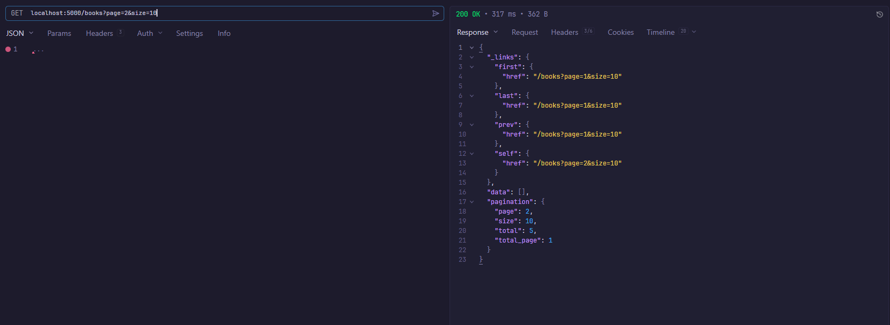

## Lọc theo Tác giả
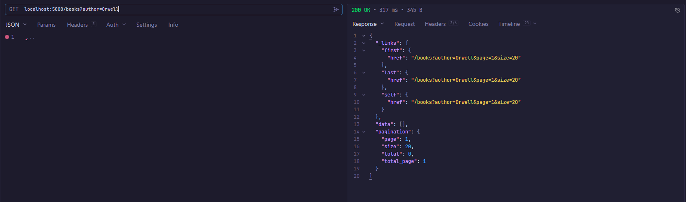

## Tìm kiếm theo Từ khóa
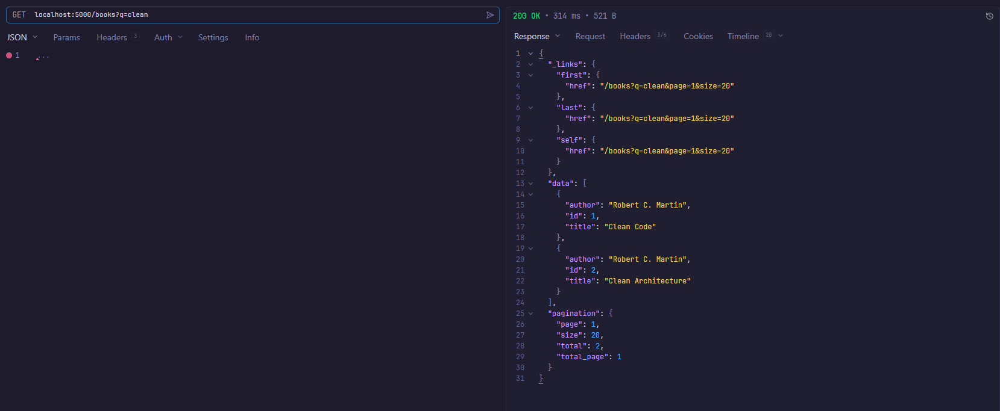

## Kiểm tra Header Cache-Control
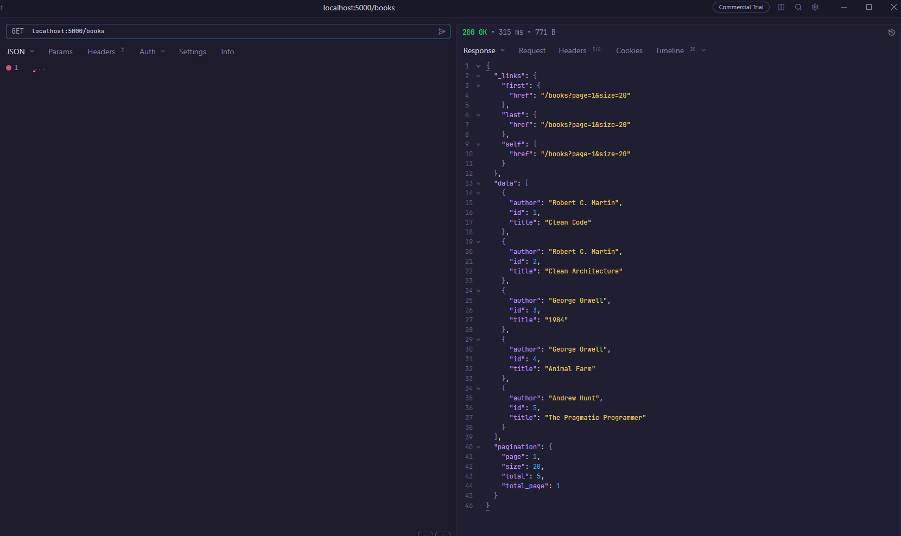

## Kiểm tra Lỗi tham số sai
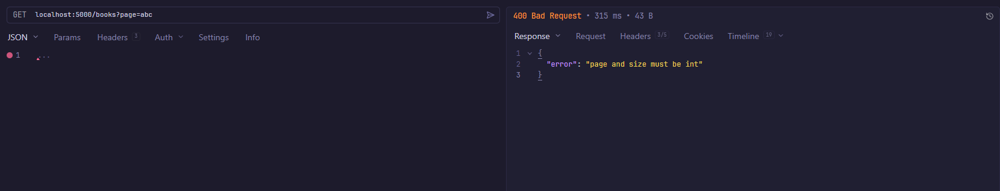