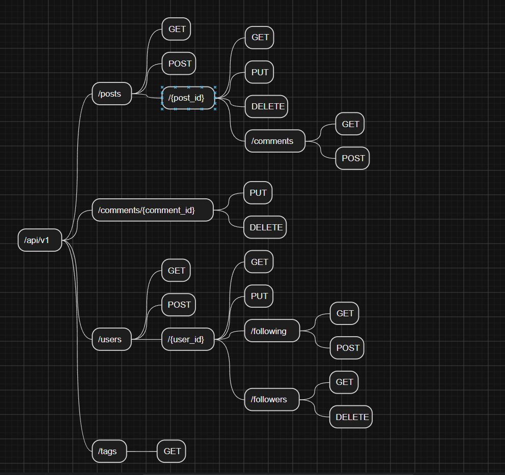

## 1. Xác định resources trong miền
- Users/Profiles
- Posts
- Comments
- Tags
- Follows

## 2. Phân loại Collection, Item và Sub-resource 

### Collection:
- /api/v1/posts         Danh sách bài viết, tạo bài viết mới
- /api/v1/users         Danh sách người dùng
- /api/v1/tags          Danh sách thẻ

### Item
- /api/v1/posts/{post_id}           Xem, sửa, xóa 1 bài viết
- /api/v1/users/{user_id}           Xem, sửa, xóa 1 người dùng
- /api/v1/comments/{comment_id}     Xem, sửa, xóa 1 bình luần

### Sub-resource 
- /api/v1/posts/{post_id}/comments          Bình luận của bài viết x
- /api/v1/users/{user_id}/followers         Danh sách người theo dõi của người dùng x
- /api/v1/users/{user_id}/following         Danh sách mà tác giả x đang theo dõi

## 3. Sơ đồ cây

