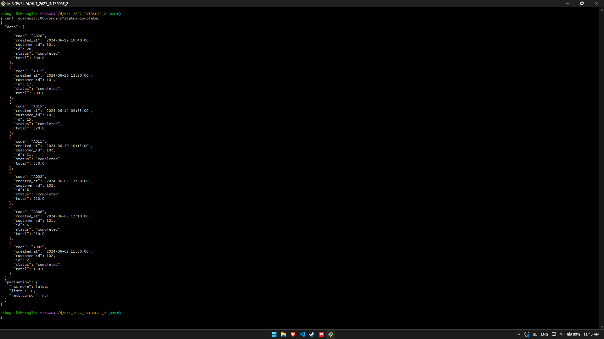
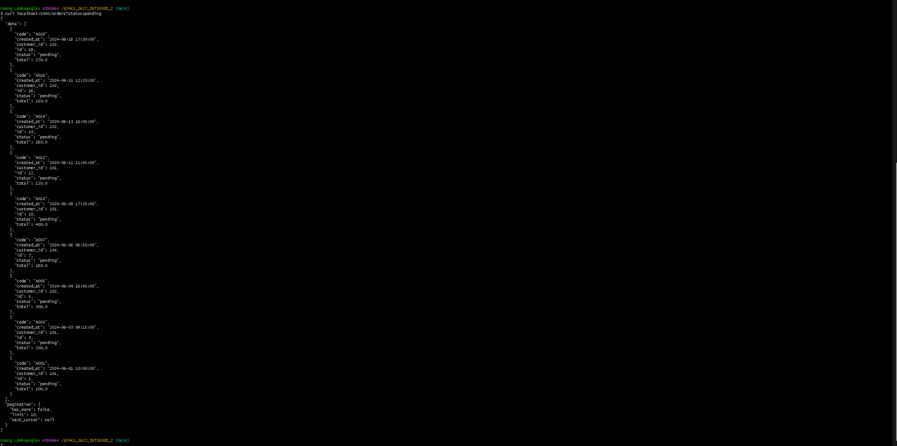
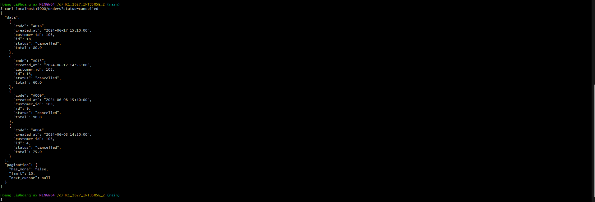
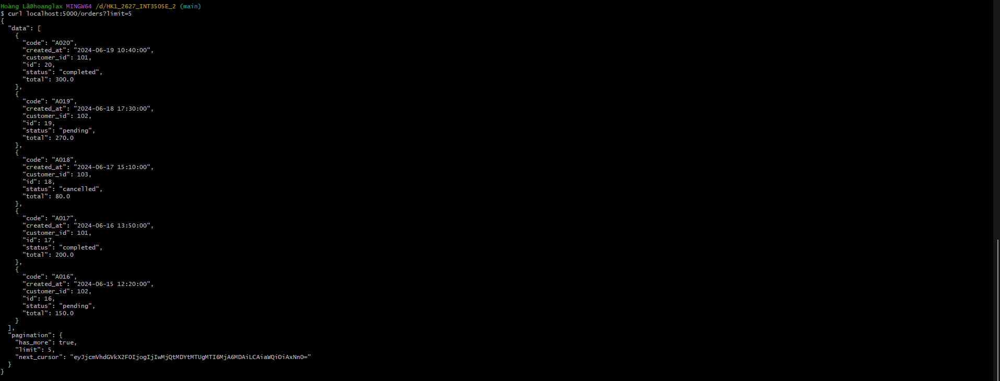
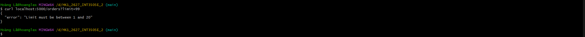
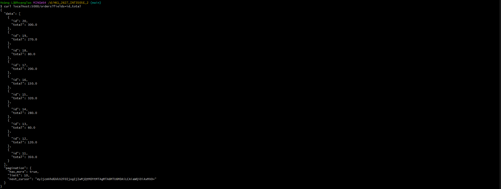
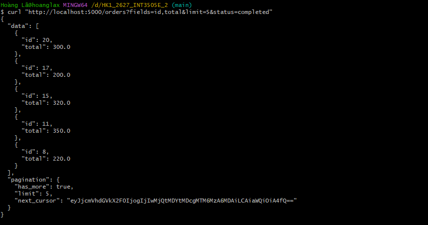

# Triển khai /orders có cursor pagination

Dữ liệu giả lập (mock_orders) có cấu trúc như sau:
{"id": 1, "code": "A001", "customer_id": 101, "status": "pending", "total": 100.0, "created_at": "2024-06-01 10:00:00"},

Trong đó "status" gồm: pending, completed, cancelled

## Kiểm thử

### Với các status:
- status=completed

- status=pending

- status=cancelled

### Với limit
Limit nằm trong khoảng [1..20], danh sách mặc định là mới nhất trước.

- Khi chọn đúng khoảng limit

- Khi chọn ngoài khoảng hợp lệ

### Sparse Fieldsets 
- Giữ đúng 2 trường id, total (limit default = 10)

### Kết hợp 4 trường

### Cursor hỏng - 400 
