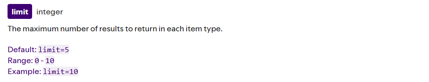
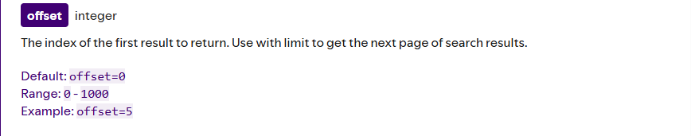
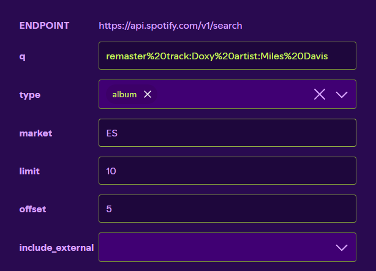
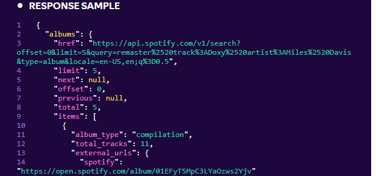
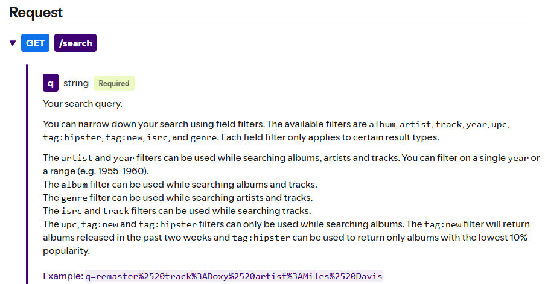
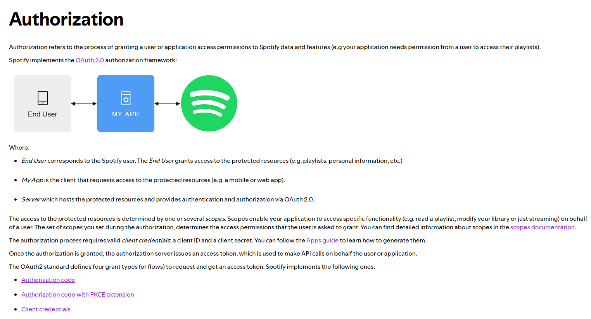

# BÀI LÀM: REVIEW SPOTIFY WEB API
Nhóm 8:
* Lã Việt Hoàng - 24021485
* Nguyễn Phan Hùng - 21021503
---

### 06. Pagination (Phân trang) - Đánh giá: Rất tốt

* **Chi tiết:**
  * Toàn bộ danh sách (collection) đều được phân trang bắt buộc.
  * Hỗ trợ **Offset-based** với hai tham số `limit` (default=5, Range: 0-10) và `offset` (default=0, Range: 0-1000). Hỗ trợ cả **Cursor-based** (dùng `after` cho các endpoint truy xuất dữ liệu gần đây).
  
  

  * Response trả về gói gọn trong object chứa đầy đủ metadata rõ ràng: `total`, `limit`, `offset`, `next`, `previous`.

---

### 07. Filter / Sort (Bộ lọc & Sắp xếp) — Đánh giá: Tốt ở Search, hạn chế ở Collection

* **Chi tiết:**
  * **Search (`/v1/search`):** Hỗ trợ lọc chuyên sâu bằng bộ lọc trường (Field filters) qua tham số `q`, ví dụ: `album:`, `artist:`, `track:`, `year:`, `genre:`, `isrc:`, `tag:new`.
  * **Hạn chế:** Các endpoint danh sách thông thường chỉ lọc theo nhóm có sẵn (`include_groups`), chưa hỗ trợ multi-field sort động và chưa hỗ trợ chọn trường dữ liệu trả về (sparse fieldsets).

---

### 08. Authentication & Security (Xác thực & Bảo mật) — Đánh giá: Rất tốt

* **Chi tiết:**
  * **Xác thực:** Sử dụng chuẩn **OAuth 2.0**, bắt buộc gửi Token qua Header `Authorization: Bearer <access_token>`, không truyền qua URL query string[cite: 2].
  * **Phân quyền:** Quản lý truy cập bằng hệ thống Scopes[cite: 2].
  * **Rate Limit:** Khi gọi quá giới hạn request, API trả về mã HTTP `429 Too Many Requests` kèm Header `Retry-After: <seconds>` quy định thời gian chờ[cite: 2].

---

### 09. Versioning & Deprecation (Phiên bản & Ngưng hỗ trợ) - Đánh giá: Tốt

* **Chi tiết:**
  * **URI Versioning:** Thống nhất đặt tiền tố phiên bản ngay đầu URL path (`https://api.spotify.com/v1/...`).
  * **Deprecation Policy:** Spotify có trang Developer Changelog công khai và gửi thông báo trước nhiều tháng khi có thay đổi lớn hoặc ngừng hỗ trợ (deprecate) một endpoint/param.

---

### Tổng kết điểm phần B (Spotify Web API)
* **Điểm mạnh:** Thiết kế RESTful nhất quán, quản lý phân trang chuyên nghiệp qua PagingObject, hệ thống bảo mật OAuth 2.0 và Rate Limiting chuẩn mực.
* **Điểm cần cải tiến:** Mở rộng khả năng lọc multi-field sort động cho các collection thông thường và bổ sung cơ chế sparse fieldsets cho toàn hệ thống.